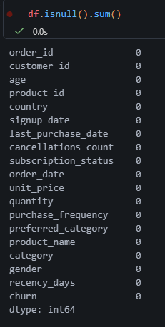
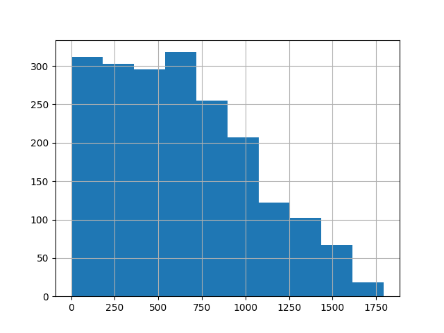

# Análisis de gráficos

## Variables con más nulos

Todas las columnas del dataset usado no tienen valores nulos. Como se puede observar en la siguiente imagen:

## Variables con distribución muy sesgadas

Se observa que existe una variable con distribución sesgada (desequilibrada):

- recency_day: La mayoría de número de clientes se encuentran en rangos altos de días, lo que demuestra que muchos cliente no han hecho una compra recientemente.

Esta distribución desequilibrada podría influir en los modelos y requeriría un ajuste adicional.

Por ello, surgen preguntas como:

- ¿Por qué todos los clientes presentan solamente una compra?
- ¿Este dataset incluye únicamente a clientes nuevos?
- ¿La variable last_purchase_date influye directamente en el churn?
